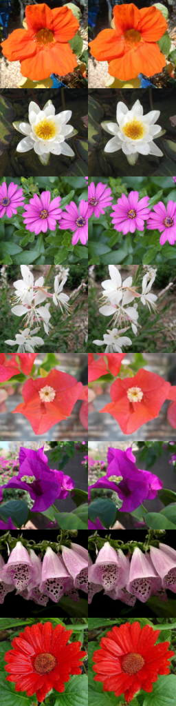
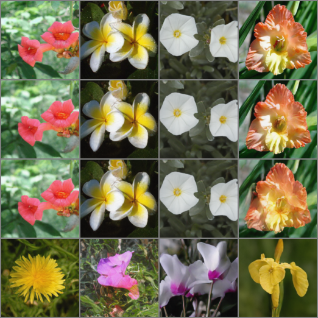

# VQGAN
This is an implementation of VQGAN from the paper [Taming Transformers for High-Resolution Image Synthesis](https://arxiv.org/abs/2012.09841) by Patrick Esser, Robin Rombach, Björn Ommer. The purpose of this repo is to give a clean and simple implementation of VQGAN that can be easily understood and modified.
## Training details
The training of VQGAN consists of two parts:
1. Training the VQGAN model
   The difficult part is to balance the training of the generator and discriminator. The generator should be trained to generate realistic images, while the discriminator should be trained to distinguish between real and fake images. The discriminator should not be too good, otherwise the generator will not be able to generate realistic images. This part can be done by tuning the weights of adversarial loss(`disc_weight`).
2. Training the taming transformer
   The taming transformer is trained to generate images from the codebook of VQVAE. A pretrained VQVAE will be used and frozen during the training of the taming transformer. A GPT2 model is used to sample latent vectors from the codebook. The latent vectors are then fed into the taming transformer to generate images. A lower learning rate should be used to train the GPT2 model (e.g. `1e-4` with noam scheduler).
## Results
### VQGAN
The right image is the reconstructed image from VQGAN. \

### Taming Transformer
Content of each row:
1. The original image
2. The reconstructed image from VQGAN
3. The generated image from taming transformer with half of the provided latent vectors
4. The generated image from taming transformer with zero given latent vectors (random sampling)

## Usage
The training configs are stored in `config` folder. You can train your own model with the following command:
```
python main.py --config-name <config_name>
```
## Special tweaks used in my code:
1. Wandb logging is used to log the training process. You can disable it by using environment variable `WANDB_MODE=offline`.
2. Lightning fabric is used to utilize mixed precision training and distributed training.
3. 8-bit optimizer is used to save VRAM usage.
4. Self-attention in mingpt is replaced with flash attention in Pytorch 2.0.

## Acknowledgement
1. [VQGAN](https://github.com/dome272/VQGAN-pytorch/) implementation by dome272
2. Original implementation of [Taming Transformer](https://github.com/CompVis/taming-transformers) by CompVis